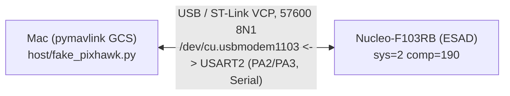
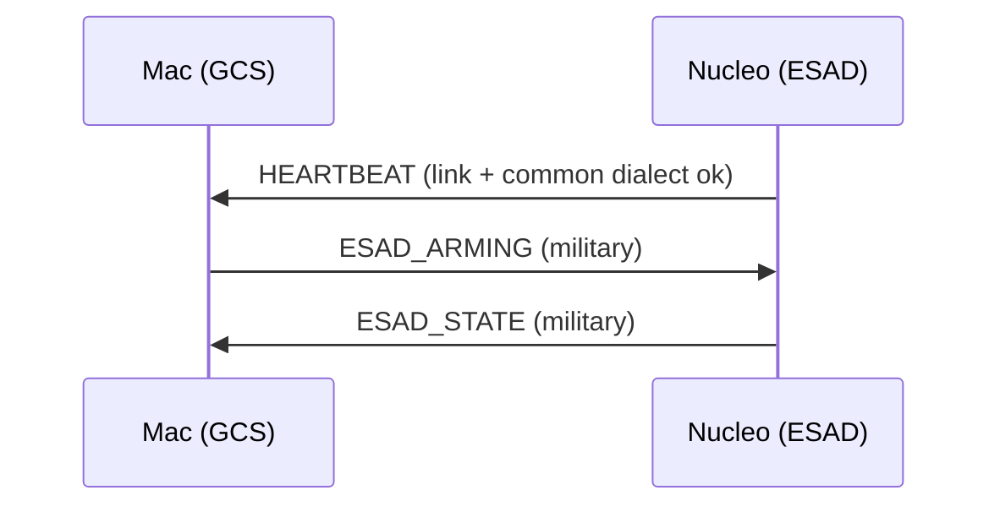
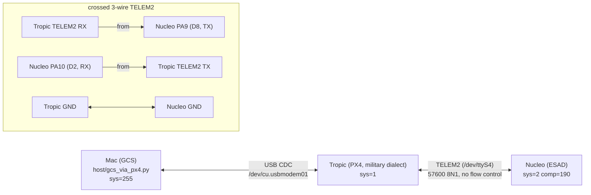
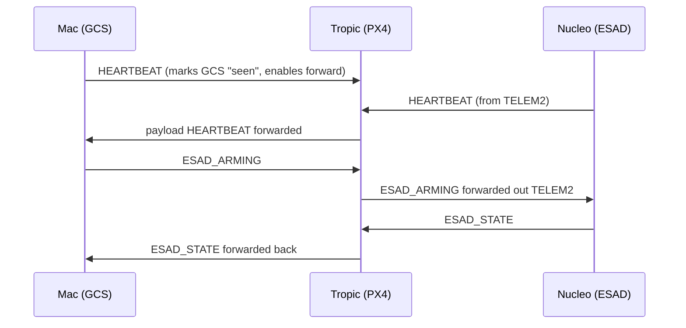

# nucleo-mavlink-m

A MAVLink peripheral running on a **Nucleo-F103RB**, speaking the standard
`common` dialect plus the **military** dialect from
[Dronecode/mavlink-military](https://github.com/Dronecode/mavlink-military).

The Nucleo stands in for an **ESAD** (an arming/munition device) on the MAVLink
bus. It emits `HEARTBEAT` and answers `ESAD_ARMING` with `ESAD_STATE`. The point
of the project is to prove, on real hardware, that the military dialect
round-trips end to end: both when a host GCS talks to the board directly, and
when **PX4** sits in the middle as a router forwarding the military messages it
was compiled to understand.

## The two topologies

### A. Direct: Mac ↔ Nucleo

A pymavlink GCS on the Mac talks straight to the Nucleo over the ST-Link virtual
COM port. No PX4, no external wiring. This is the standalone bring-up mode: use
it to confirm the sketch is alive and the military dialect works before adding
PX4.





Run it:

```sh
cd host
./generate_dialect.sh                    # once: produces military_dialect.py
python3 fake_pixhawk.py --arm 1          # --arm 0 to disarm
```

> In topology A the sketch's `Serial` (USART2) is the MAVLink link. In topology
> B (below) the current firmware moves the MAVLink link to **USART1** and keeps
> USART2 as a debug console. The firmware as shipped targets topology B; for a
> pure topology-A run you would point the FC link at `Serial`. See
> [docs/WIRING.md](docs/WIRING.md).

### B. Through PX4: Mac ↔ PX4 ↔ Nucleo

The real target. A GCS on the Mac talks to a PX4 flight controller (an NXP
**MR-Tropic**) over USB. PX4 forwards ESAD traffic out **TELEM2** to the Nucleo
and forwards the replies back. PX4 must be built with the military dialect
compiled in, or the `ESAD_*` messages fail CRC and get silently dropped.

Link topology and the crossed 3-wire TELEM2 connection:



Message flow (PX4 is the router; it forwards each message in both directions):



Run it (after building/flashing both boards and setting the PX4 params, see
[docs/SETUP.md](docs/SETUP.md)):

```sh
cd host
./generate_dialect.sh
python3 gcs_via_px4.py --arm 1
```

Expected tail:

```
PASS: full loop Mac -> PX4 -> Nucleo -> PX4 -> Mac over the military dialect.
```

## Hardware

- **Nucleo-F103RB** (STM32F103RB, Cortex-M3, 128 KB flash / 20 KB RAM). Onboard
  ST-Link provides both the flash drive and a USB virtual COM port. LD2 (green,
  PA5) is the arming indicator.
- **NXP MR-Tropic** flight controller, PX4 target `nxp_mr-tropic_default`. Only
  needed for topology B.
- Three jumper wires for the TELEM2 link (topology B only).

## Firmware behaviour

- Emits `HEARTBEAT` at 1 Hz (`sys=2`, `comp=190`, `MAV_TYPE_GENERIC`,
  `MAV_AUTOPILOT_INVALID`). Proves the link and the common dialect.
- On `ESAD_ARMING`, replies `ESAD_STATE` echoing the requested state back as
  `arming_status`. Proves the military dialect round-trips, RX and TX.
- LD2 (PA5) is **solid on when armed, off when disarmed**. Single-colour GPIO
  LED, no RGB.

Footprint is roughly 15% flash / 9% RAM on the F103RB. See
[docs/PROTOCOL.md](docs/PROTOCOL.md) for the message details.

## Layout

```
nucleo_mavlink_m/            Arduino sketch (compiled with arduino-cli)
  nucleo_mavlink_m.ino       heartbeat + ESAD echo logic
  mavlink_config.h           MAVLink build-time trims for the F103
  mavlink/                   generated C headers (military + common + ...)
host/
  fake_pixhawk.py            topology A: direct Mac <-> Nucleo test
  gcs_via_px4.py             topology B: Mac <-> PX4 <-> Nucleo test
  generate_dialect.sh        regenerates the pymavlink military dialect
  px4_telem2_setup.txt       PX4 TELEM2 params for topology B
  requirements.txt           pymavlink + pyserial
docs/
  SETUP.md                   full toolchain + build/flash + PX4 config
  WIRING.md                  pin-level TELEM2 wiring (read this before B)
  PROTOCOL.md                the military messages, IDs, LED/arming behaviour
  TROUBLESHOOTING.md         symptoms and fixes
```

## Docs

- **[docs/SETUP.md](docs/SETUP.md)** — install the toolchains, generate the
  dialect, build and flash both boards, set the PX4 params.
- **[docs/PX4_INTEGRATION.md](docs/PX4_INTEGRATION.md)** — how to add the
  mavlink-military dialect to PX4 on **any** board (not just the Tropic): the
  `.px4board` dialect line, where `military.xml` goes, and the i.MXRT linker fix.
- **[docs/WIRING.md](docs/WIRING.md)** — the TELEM2 wiring, with the
  D0/D1-vs-D8/D2 pin trap called out.
- **[docs/PROTOCOL.md](docs/PROTOCOL.md)** — `ESAD_ARMING` / `ESAD_STATE`
  fields and IDs, system/component identity, LED behaviour.
- **[docs/TROUBLESHOOTING.md](docs/TROUBLESHOOTING.md)** — when the payload
  heartbeat never shows up, the INT32 param gotcha, the linker relocation error,
  and more.
