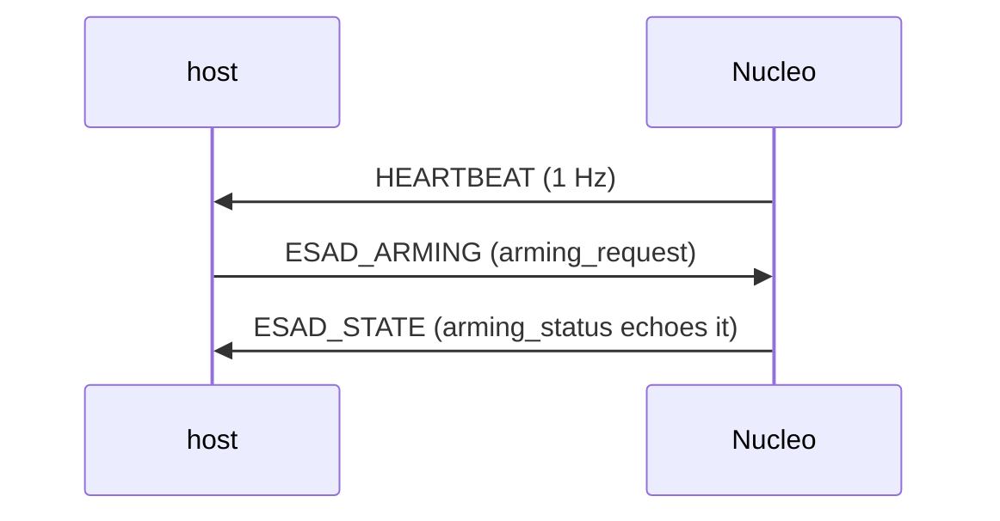

# Protocol

The wire protocol is MAVLink 2.0. The Nucleo speaks the `common` dialect (for
`HEARTBEAT`) plus the **military** dialect from
[Dronecode/mavlink-military](https://github.com/Dronecode/mavlink-military), of
which it uses exactly two messages: `ESAD_ARMING` (RX) and `ESAD_STATE` (TX).

The full military dialect (`military.xml`) defines the 53000-block messages
(target sets, fires, BDA, ESAD, RWS). This project exercises only the ESAD pair;
the rest ride along in the compiled dialect but are unused here.

## Identity

| Node            | System | Component | Notes                                       |
|-----------------|--------|-----------|---------------------------------------------|
| PX4 (Tropic)    | 1      | 1         | the autopilot / router (topology B)         |
| Nucleo (ESAD)   | **2**  | **190**   | its own system, so PX4 routes it separately |
| Host GCS        | 255    | 190       | `fake_pixhawk.py` / `gcs_via_px4.py`        |

The Nucleo is deliberately its **own** system (2), not a component under PX4's
system 1. That way PX4 treats it as a distinct node to forward, rather than
mistaking it for one of its own components. It emits `HEARTBEAT` at 1 Hz with
`MAV_TYPE_GENERIC` / `MAV_AUTOPILOT_INVALID` and `MAV_STATE_ACTIVE`.

## ESAD_ARMING — 53008 (host → Nucleo)

The arming command. The firmware decodes it and acts on `arming_request`.

| Field                   | Type     | Meaning                                             |
|-------------------------|----------|-----------------------------------------------------|
| `time_usec`             | uint64_t | Timestamp (UNIX epoch µs UTC).                      |
| `arming_challenge_hash` | uint32_t | Challenge hash matching the active `ESAD_STATE` hash. |
| `arming_request`        | uint8_t  | Requested state, enum `ESAD_ARMING_REQUEST`.        |

`ESAD_ARMING_REQUEST`:

| Value | Name                  |
|-------|-----------------------|
| 0     | `ESAD_REQUEST_DISARM` |
| 1     | `ESAD_REQUEST_ARM`    |

> The dialect spec says the `arming_challenge_hash` must match the value last
> broadcast in `ESAD_STATE` before a request is accepted. **This demo firmware
> does not enforce the challenge** — it acts on any `ESAD_ARMING` it receives.
> The host scripts send a fixed `0xDEADBEEF`. Enforcing the challenge is left as
> a real-implementation concern; the goal here is to prove the dialect
> round-trips on hardware, not to be a safety-certified ESAD.

`ESAD_ARMING` has **no** `target_system` / `target_component` fields. It is a
broadcast. In topology B, PX4 forwards it out TELEM2 because `MAV_1_FORWARD=1`,
not because of any address-based routing.

## ESAD_STATE — 53007 (Nucleo → host)

The telemetry reply. The firmware sends one immediately on receiving
`ESAD_ARMING`, with `arming_status` echoing the request.

| Field                   | Type       | Firmware value                                  |
|-------------------------|------------|-------------------------------------------------|
| `time_usec`             | uint64_t   | `micros()` — board uptime, **not** wall-clock (no RTC). |
| `arming_challenge_hash` | uint32_t   | 0                                               |
| `fault_flags`           | uint32_t   | 0 (enum `ESAD_FAULT_FLAGS` bitmask, no faults). |
| `input_1`               | float      | 0.0                                             |
| `input_2`               | float      | 0.0                                             |
| `sw_version_hash`       | uint8_t[8] | `"nuc103rb"` (8 ASCII bytes, board build tag).  |
| `arming_status`         | uint8_t    | echoes the request → enum `ESAD_ARMING_STATUS`. |
| `munition_status`       | uint8_t    | `ESAD_MUNITION_PRESENT` (1).                    |
| `ignition_status`       | uint8_t    | `ESAD_IGNITION_OPEN` (0).                       |
| `munition_type`         | uint8_t    | 0                                               |

Because `time_usec` is board uptime rather than wall-clock, the host cannot gate
replies on a wall-clock timestamp. `gcs_via_px4.py` instead drains any buffered
`ESAD_STATE` before sending a fresh `ESAD_ARMING`, so the reply it matches is
genuinely the response to that request.

### Enums in ESAD_STATE

`ESAD_ARMING_STATUS`:

| Value | Name                   |
|-------|------------------------|
| 0     | `ESAD_ARMING_DISARMED` |
| 1     | `ESAD_ARMING_ARMED`    |
| 2     | `ESAD_ARMING_FAULT`    |

`ESAD_MUNITION_STATUS`:

| Value | Name                       |
|-------|----------------------------|
| 0     | `ESAD_MUNITION_NOT_PRESENT`|
| 1     | `ESAD_MUNITION_PRESENT`    |
| 2     | `ESAD_MUNITION_READY`      |
| 3     | `ESAD_MUNITION_FAULT`      |

`ESAD_IGNITION_STATUS`:

| Value | Name                    |
|-------|-------------------------|
| 0     | `ESAD_IGNITION_OPEN`    |
| 1     | `ESAD_IGNITION_CLOSED`  |
| 2     | `ESAD_IGNITION_FIRED`   |
| 3     | `ESAD_IGNITION_FAULT`   |

`ESAD_FAULT_FLAGS` (bitmask, unused by this firmware — always 0):

| Bit | Name                          |
|-----|-------------------------------|
| 1   | `ESAD_FAULT_WIRING`           |
| 2   | `ESAD_FAULT_POWER_GLITCH`     |
| 4   | `ESAD_FAULT_SIGNAL_INTEGRITY` |
| 8   | `ESAD_FAULT_SENSOR_ACC`       |
| 16  | `ESAD_FAULT_SENSOR_LIDAR`     |

## Arming request → status mapping

The request enum and the status enum line up on the 0/1 values by design, which
is why the host scripts compare them directly:

| `arming_request` sent | firmware sets `arming_status` | LD2 (PA5) |
|-----------------------|-------------------------------|-----------|
| 1 (`ARM`)             | 1 (`ARMED`)                   | solid ON  |
| 0 (`DISARM`)          | 0 (`DISARMED`)                | OFF       |

## LED behaviour

LD2 (green, PA5) is the arming indicator: **solid on when armed, off when
disarmed**. It is set in the `ESAD_ARMING` handler and reflects arming state
only — it does **not** blink with the heartbeat. LD2 is a single-colour GPIO LED
with no colour control on this board.

## Message flow

Topology A (direct):

Topology B (through PX4) is identical on the wire; PX4 forwards each message in
both directions. The host additionally waits to see the payload's `HEARTBEAT`
arrive via PX4 before sending `ESAD_ARMING`, which confirms PX4 can see the
Nucleo across TELEM2.

## Why PX4 must be built with the military dialect

PX4 forwards any message that **parses** — there is no allowlist. But a message
only parses if its ID, length, and CRC-extra byte are known to the running
firmware. The `ESAD_*` messages are only known if the military dialect was
**compiled into** that PX4 build (`CONFIG_MAVLINK_DIALECT="military"`). Without
it, the ESAD frames fail the CRC-extra check and PX4 drops them silently — the
link looks alive (heartbeats flow) but ESAD traffic vanishes. See
[PX4_INTEGRATION.md](PX4_INTEGRATION.md#why-the-board-has-to-be-rebuilt-not-just-configured).
